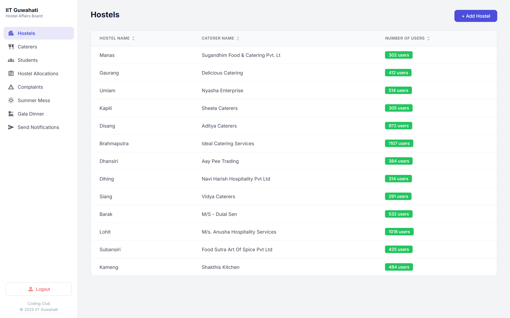
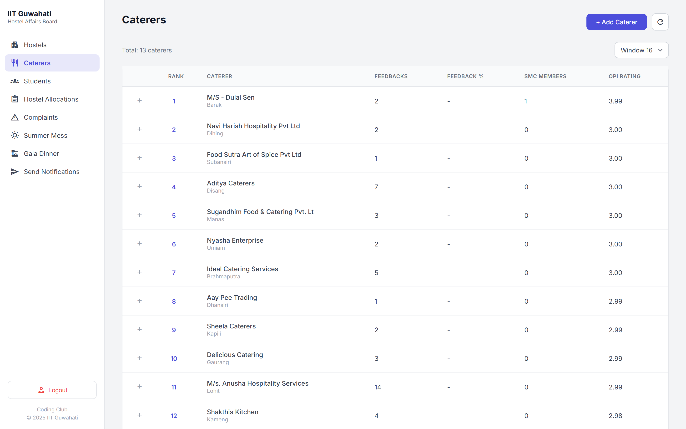
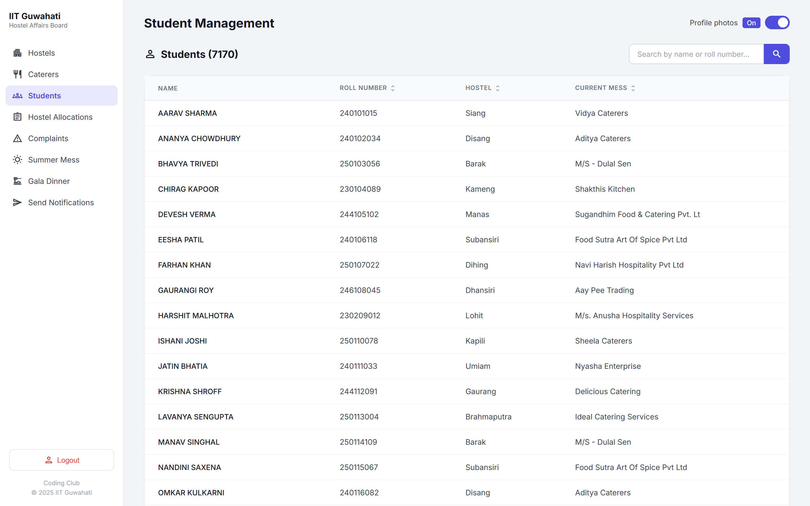
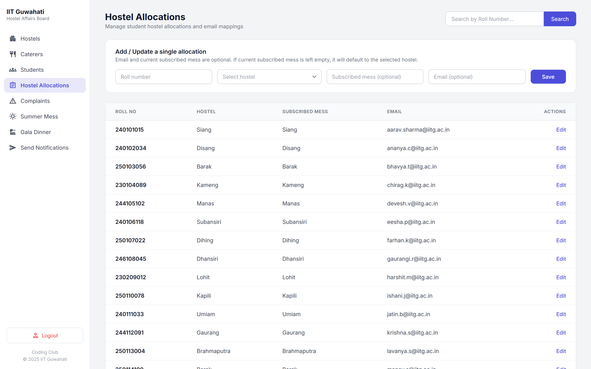
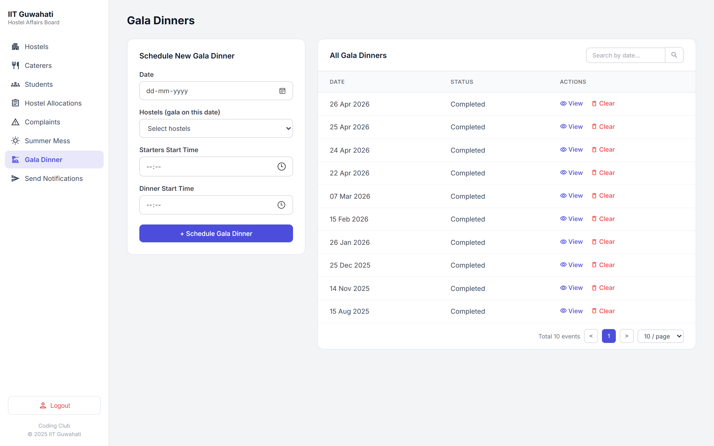
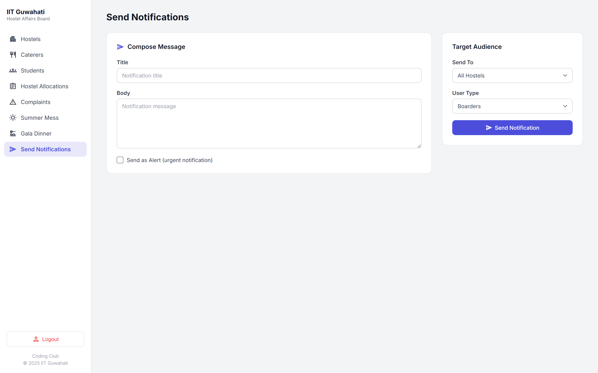

# IIT Guwahati - Hostel Affairs Board (HABit) Admin Portal

An intuitive and comprehensive administration portal for managing hostel operations, catering services, student directory, room allocations, gala dinner scans, and boarder communications at **Indian Institute of Technology Guwahati (IIT Guwahati)**.

🔗 **Live Portal URL:** [https://designedbyvishesh.github.io/HABit_Admin_Portal/](https://designedbyvishesh.github.io/HABit_Admin_Portal/)

---

## 📸 Portal Preview & Screenshots

### 1. Hostels Management & Overview
Comprehensive breakdown of all IIT Guwahati hostels (Barak, Brahmaputra, Dhansiri, Dihing, Disang, Gaurang, Kameng, Kapili, Lohit, Manas, Siang, Subansiri, Umiam), boarder counts, capacity limits, allocated caterers, and contact details.



---

### 2. Caterers Management & Feedback Ratings
Track caterer ratings, monthly feedback, rank standings, and service performance across hostels.



---

### 3. Students Directory & Roll Search
Search and view boarders across hostels with real-time room occupancy and registration details.



---

### 4. Hostel Room Allocations
Manage automated and manual room allocations per hostel with pending request status and capacity tracking.



---

### 5. Gala Dinner Management & Live Food Scan Counts
Monitor live scan metrics for Starters, Main Course, and Desserts along with event menus.



---

### 6. Notification & Announcement Broadcast Center
Send targeted alerts and announcements to boarders and specific hostels.



---

## ✨ Key Features

- 🏢 **Hostel Administration:** Track capacity, active boarders, and assigned caterers.
- 🍽️ **Catering & Feedback System:** View caterer performance scores and student feedback.
- 🛏️ **Allocations & Room Management:** Manage room assignments and view occupancy rates.
- 🔍 **Student Database:** Search student details by Roll Number or Name.
- 🍛 **Special Events & Gala Dinner:** Live food QR scan tracking and serving schedule.
- 📢 **Broadcast Announcements:** Send priority alerts to individual hostels or campus-wide.
- 📱 **Responsive UI:** Optimized for both desktop and mobile viewing.

---

## 🚀 Getting Started Locally

1. **Clone the repository:**
   ```bash
   git clone https://github.com/designedbyvishesh/HABit_Admin_Portal.git
   cd HABit_Admin_Portal
   ```

2. **Run locally:**
   Simply open `index.html` in your web browser:
   ```bash
   start index.html
   ```

---

## 🛠️ Built With

- **HTML5 & CSS3** - Modern vanilla responsive design & Google Fonts (Inter)
- **Material Icons Outlined** - Clean, intuitive iconography
- **JavaScript** - Single Page Application (SPA) client-side routing & modal workflows
- **GitHub Pages** - Fast and reliable static web hosting

---

*Designed & Maintained for the IIT Guwahati Hostel Affairs Board (HABit).*
